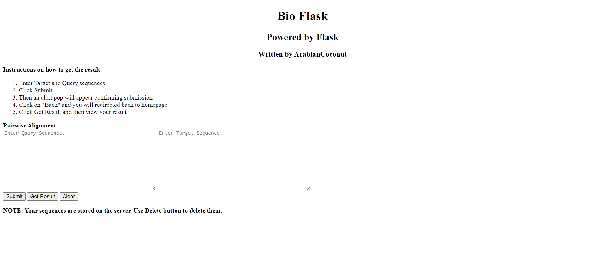

# BioFlask web interface for custom pairwise alignment

## Made in Python 3.11.X, Flask and BioPython

### Author: ArabianCoconut

### Date: 2023-04-25

---

## How to use

1. Clone the repository
2. Install the requirements
3. Run the backend.py file
4. Open the browser and go to <http://localhost:5000>
5. Enjoy!

---

## UML Diagram

---

## Screenshots

