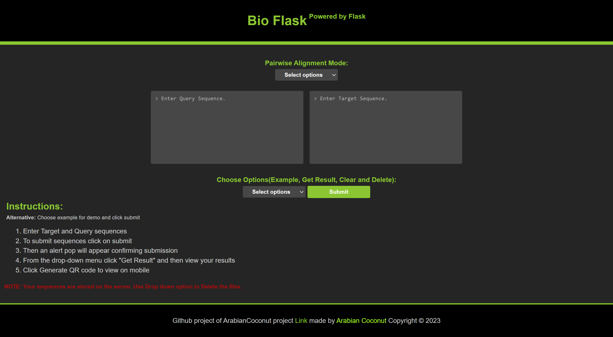

# BioFlask web interface for custom pairwise alignment

## Made in Python 3.11.X, Flask and BioPython
## Designed in Figma

### Author: [ArabianCoconut](https://github.com/ArabianCoconut)
### Contributor: [Abd Kayali](https://github.com/AbdKayali3)

### Date: 2023-04-25

---

## Demo website

<https://bioflask.onrender.com/>

---

## How to use

1. Clone the repository
2. Install the requirements
3. Run the main.py file
4. Open the browser and go to <http://localhost:5000>
5. Enjoy!

---

## Running using Docker

1. docker pull arabiancoconut/bio_flask:Alpha
2. docker run -p 5000:5000 arabiancoconut/bio_flask:Alpha
3. Open the browser and go to <http://localhost:5000>
4. Enjoy!

---

## Screenshots

